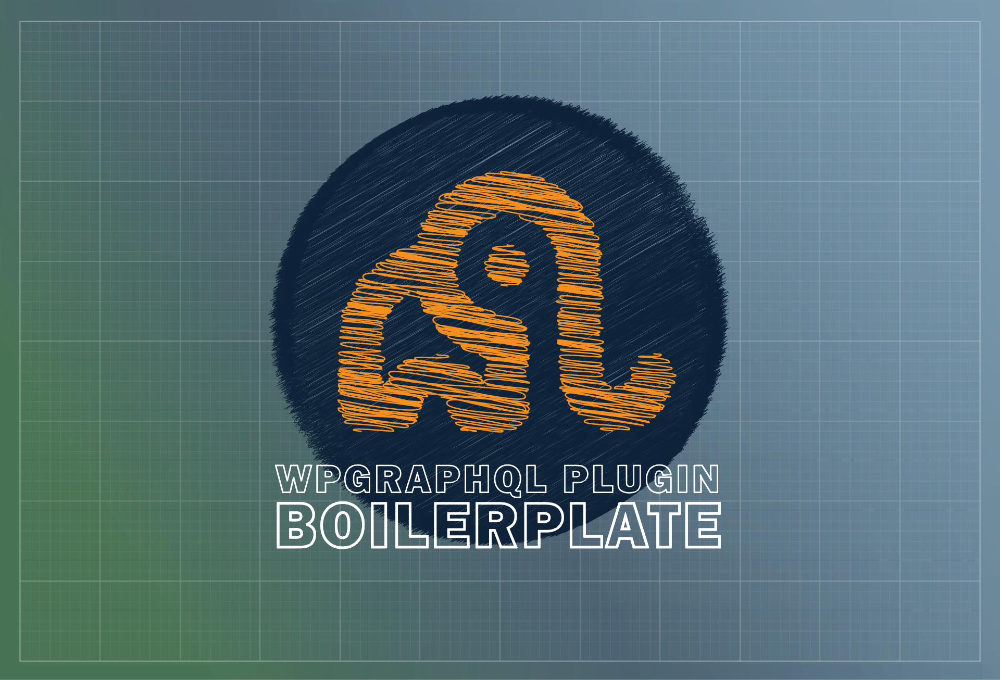

# WPGraphQL Plugin Boilerplate

🚨 NOTE: This is prerelease software. Use at your own risk 🚨

A boilerplate for creating WPGraphQL extensions. Can be used as a Composer dependency or as a tool to scaffold your own plugin.

- [Join the WPGraphQL community on Slack.](https://join.slack.com/t/wp-graphql/shared_invite/zt-3vloo60z-PpJV2PFIwEathWDOxCTTLA)

Inspired by the following projects and their contributors:

- [WPGraphQL](https://github.com/wp-graphql/wp-graphql)
- [WPGraphQL BuddyPress](https://github.com/wp-graphql/wp-graphql-buddypress)
- [WPGraphQL for GravityForms](https://github.com/harness-software/wp-graphql-gravity-forms)
- [WPGraphQL for WooCommerce](https://github.com/wp-graphql/wp-graphql-woocommerce)

## Features

- Default folder structure that mirrors WPGraphQL.
- Helper classes, interfaces, methods, and traits to make it easier to register new GraphQL types.
- Dependency management with [Composer](https://getcomposer.org/).
- Code sniffing with [PHPCS](https://github.com/PHPCSStandards/PHP_CodeSniffer), [WordPress Coding Standards](https://developer.wordpress.org/coding-standards/wordpress-coding-standards/), and [Automattic's WordPress VIP Coding Standards](https://github.com/Automattic/VIP-Coding-Standards)
- Static Analysis with [PHPStan](https://phpstan.org/)
- PHPUnit Testing with [`@wordpress/env`](https://www.npmjs.com/package/@wordpress/env) (wp-env), which manages a local, [Docker](https://www.docker.com/)-based WordPress environment for you.
- Automated CI with [Github Actions](https://github.com/features/actions).

## System Requirements

- PHP 7.4+ | 8.0+ | 8.1+
- WordPress 6.0+
- WPGraphQL 1.8.0+

## Getting Started

### As a Composer dependency

We recommend installing this boilerplate using Strauss, to prevent plugin conflicts with other libraries.
For more information see this [explainer from StellarWP](https://github.com/stellarwp/global-docs/blob/main/docs/strauss-setup.md).

#### 1. Add the dependency to your project.

```bash
composer require axewp/wp-graphql-plugin-boilerplate
```

#### 2. Configure Strauss.

1. Add the following scripts to composer .json:

```json
"scripts": {
  "pre-prefix-namespaces": [
    "test -d vendor-prefixed || mkdir vendor-prefixed",
    "test -f ./bin/strauss.phar || curl -o bin/strauss.phar -L -C - https://github.com/BrianHenryIE/strauss/releases/download/0.22.2/strauss.phar"
  ],
  "prefix-namespaces": [
    "@php bin/strauss.phar",
    "@composer dump-autoload"
  ],
  "pre-install-cmd": [
    "@pre-prefix-namespaces"
  ],
  "pre-update-cmd": [
    "@pre-install-cmd"
  ],
  "post-install-cmd": [
    "@prefix-namespaces"
  ],
  "post-update-cmd": [
    "@prefix-namespaces"
  ]
}
```

2. Add the strauss config to "extra" in composer.json:

```json
"extra": {
  "strauss": {
    "target_directory": "vendor-prefixed",
    "namespace_prefix": "WPGraphQL\\PluginName\\Vendor\\",
    "classmap_prefix": "WPGraphQL_PluginName",
    "constant_prefix": "GRAPHQL_PLUGINNAME",
    "delete_vendor_packages": true,
    "include_modified_date": false,
    "update_call_sites": false,
    "exclude_from_prefix": {
      "namespaces": [],
      "file_patterns": []
    }
    "packages": [
      "axepress/wp-graphql-plugin-boilerplate"
    ],
  }
},
```

3. Include the autoloader in your composer.json's classmap.

```diff
"autoload": {
  "files": [
    "access-functions.php"
  ],
  "psr-4": {
    "WPGraphQL\\PluginName\\": "src/"
  },
+  "classmap": [
+    "vendor-prefixed/"
+  ]
},
```

### As a plugin starter

#### 1. Initialize the plugin

Creating your WPGraphQL plugin is as simple as downloading the project to your machine and running `curl -fsSL https://raw.github.com/AxeWP/wp-graphql-plugin-boilerplate/master/bin/install.sh | bash`.

You will be asked to provide the following configuration details, or you can pass them as flags.

- **Branch (`--branch`)** : The Github branch to use as the source.
- **Name (`--name`)** : The name of your plugin (e.g. `My Plugin for WPGraphQL`).
- **Namespace (`--namespace`)**: The PHP namespace to be used for the plugin (e.g. `MyPlugin`).
- **Path (`--path`)**: The path to the directory directory where the plugin should be created (e.g. `mysite/wp-content/plugins`).
- **Prefix (`--prefix`)**: The plugin prefix (in snake case). This will be used to generate unique functions, hooks and constants (e.g. `my_plugin`).
- **Slug (`--slug`)**: The slug (in kebab-case) to use for the plugin (e.g. `wp-graphql-my-plugin`).

Alternatively, you can download the repository and run `composer create-plugin`.

#### 2. Set up your local environment

This plugin uses [`@wordpress/env`](https://www.npmjs.com/package/@wordpress/env) (wp-env) to run a local WordPress environment in Docker.

1. Install [Node](https://nodejs.org/) (see `.nvmrc` for the version) and [Docker](https://www.docker.com/).
2. From the plugin directory, run `npm install`.
3. Start the environment with `npm run wp-env start` (or the test environment with `npm run wp-env:test start`).

##### Project Structure

```properties

wp-graphql-plugin-name                # This will be renamed by `create-plugin` to the provided slug.
├── .github
│   ├── workflows
│   │   ├── ci.yml                     # Github workflow for PHPCS, PHPStan, and PHPUnit.
│   │   ├── upload-release.yml         # Uploads the release package as a Github release asset.
│   │   └── upload-schema-artifact.yml # Generates a schema artifact on Github release.
│   └── dependabot.yml                # Keeps Github Actions dependencies up to date.
├── .wordpress.org                    # Assets for use in WordPress's plugin directory.
├── bin
│   └── strauss.phar                  # Downloaded by Composer; used to prefix vendored dependencies.
├── phpstan
│   └── constants.php                 # Stubbed plugin constants for PHPStan.
├── src
│   ├── Admin                         # Classes for modifying the WP dashboard.
│   │   └── Settings
│   │       └── Settings.php          # Adds custom settings to WPGraphQL's settings page.
│   ├── Connection                    # GraphQL connections.
│   ├── Data
│   ├── Fields                        # Individual GraphQL fields.
│   ├── Model                         # GraphQL object data modelers.
│   ├── Mutation                      # GraphQL mutations
│   ├── Type                          # GraphQL types.
│   │   ├── Enum                      # Enum types.
│   │   ├── Input                     # Input types.
│   │   ├── Union                     # Union types.
│   │   ├── WPInterface               # Interface types.
│   │   └── WPObject                  # Object types.
│   ├── Utils                         # Helper functions used across the plugin
│   ├── CoreSchemaFilters.php         # Entrypoint for modifying the default schema provided by WPGraphQL
│   ├── Main.php                      # Bootstraps the plugin
│   └── TypeRegistry.php              # Entrypoint for registering GraphQL types to the schema
├── tests                             # PHPUnit tests
│   └── phpunit
│       ├── Integration                # Integration tests.
│       ├── bootstrap.php
│       └── TestCase.php
├── vendor                            # Composer dependencies
│  └── composer/autoload.php          # Composer autoloader
├── vendor-prefixed                   # Namespaced dependencies, including the wrapped AxeWP classes from this package.
├── .distignore
├── .editorconfig
├── .gitattributes
├── .gitignore
├── .nvmrc
├── .phpcs.xml.dist
├── .prettierignore
├── .prettierrc.mjs
├── .wp-env.json                      # wp-env configuration for local development.
├── .wp-env.test.json                 # wp-env configuration for running tests.
├── access-functions.php              # Globally-available functions for accessing class methods.
├── activation.php                    # Methods that run on plugin activation.
├── composer.json
├── deactivation.php                  # Methods that run on plugin deactivation.
├── LICENSE
├── package.json                      # npm scripts for wp-env, linting, and tests.
├── phpstan.neon.dist
├── phpunit.xml.dist
├── README.md                         # The repo readme file.
├── readme.txt                        # The plugin readme file.
└── wp-graphql-plugin-name.php
```

## Roadmap

- Include example files.
- Quality-of-life utils that make it easy to extend WPGraphQL.
- Extensive documentation.

## Documentation

@todo

### Recipes

@todo
